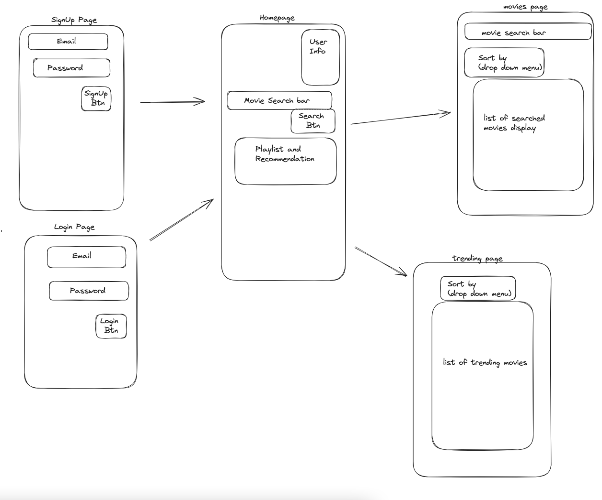

# `Any Time Flix Backend`

Node.js and Express backend for the Any Time Flix webapp.

## What it includes

* __Axios__ for API calls to TMDB.org (The Movie Database)
* JSON Web Token (__JWT__) for user sessions
* __Passport__ and __passport-local__ for authentication
* Passwords that are hashed with __BCrypt__
* Verbose Console Logs to track application activity

## Local Installation Instructions

`1` Fork and clone repo on GitHub and your system respectively\
`2` In your terminal, navigate to the folder for your cloned repo\
`3` Install the dependencies listed inside of `package.json` by running:\
*npm install\
`5` Set up a mongoDB database.  Instructions on installing and setting up MongoDB are beyond the scope of this README, follow instructions [here](https://www.mongodb.com/basics/get-started).\
`6` Set up an API account at [developer.themoviedb.org](https://developer.themoviedb.org/docs/getting-started)\
`7` Create or open you /.env file and make sure the following lines are inside it:

>TMDB_API_KEY= (your API key from TMDB goes here)\
>MONGODB_URI=  (your connection url for your database goes here)\
>JWT_SECRET=   (this can be any string of characters you want to use, no spaces)

`8` Load the server by running

>nodemon

`9` If the installation and startup was sucessful, you should see the following in your terminal.\
(note: port number may vary depending on your settings, but will default to 8000)

>[nodemon] starting `node app.js`\
>Connected Any Time Flix server to PORT: 8000\
>Connected to Any Time Flix database

## Database Models

### User - [/models/user.js](models/user.js)

| Data | Data Type | Notes |
| ------------ | ------------- | ------------------------------ |
| id | Integer | Serial Primary Key, Auto-generated |
| firstName | String | Required |
| lastName | String | Required |
| userName | String | Optional |
| city | String | Optional |
| state | String | Optional |
| country | String | Optional |
| email | String | Required Unique |
| password | String | Required |
| bio | String | Optional |
| profilePicture | image url | Optional |
| ratings | Array | see below |
| watched | Array | see below |
| watchList | Array | see below |
| liked | Array | see below |
| disliked | Array | see below |
| playlists | Array | see below |
| createdAt | Date | Auto-generated |
| updatedAt | Date | Auto-generated |

playlist contains an array of objects with two values

| Data | Data Type | Notes |
|------|-----------|-------|
| name | String | name of playlist |
| videos | Array | array of movies using schema below |

ratings, watched, watchlist, liked, disliked, and playlists in playlist data are all arrays with the following schema\
all data is from TMDB

| Data | Data Type | Notes |
|------|-----------|-------|
| id | String | id of movie |
| original_title | String | title of movie |
| poster_path | String | url of movie poster image |
| overview | String | synopsis of movie |
|rating | Number | user rating of film (exclusive to ratings object)

## Routes

### /

| Method | Path | Location | Purpose |
| ------ | ---------------- | -------------- | ------------------- |
| __GET__ | __/__ | [app.js](app.js#L32) | Test if server is running. Returns a json message to browser window. |

### /users

| Method | Path | Location | Purpose |
| ------ | ---------------- | -------------- | ------------------- |
| __GET__ | __/test__ | [users.js](controllers/users.js#L15) | Test if server is running and if users controller is working. Returns a json message to browser window.|
| __POST__ | __/signup__ | [users.js](controllers/users.js#L22) | Create a new user using data supplied by `req.body.params`, create empty arrays for user playlists, and hash their `password` before storing it in database |
| __POST__ | __/login__ | [users.js](controllers/users.js#L84) | Login user using email and password.  Return a `token`, `success` (boolean of true), `loginData` (object with {id (id from db), email (accounts Email), iat (initialized at), exp (expires at)}) and `userData` which contains object of users data from db. |
| __PUT__ | __/:id__ | [users.js](controllers/users.js#L120) | Find the user in the db based on `id`, update their info based on the request body, and return the `updatedUser`|
| __DELETE__ | __/id__ | [users.js](controllers/users.js#L146) | Find the user in the db based on `id`, remove users data, and return a `status 200` and a `message` |
| __PUT__ | __/addToList/:listName/:id__ | [users.js](controllers/users.js#L163) | __add__ the object from `req.body.movie` to the list determined by `req.params.listName`, and returns the `updatedUser` |
| __PUT__ | __/removeFromList/:listName/:id__ | [users.js](controllers/users.js#L195) | , __remove__ the object from `req.body.movie` from the list determined by `req.params.listName`, and returns the `updatedUser` |
| __GET__ | __/refreshData/ | [users.js](controllers/users.js#222) | Fetch user data and return to client |
| __GET__ | _/updateTokenExpiration__ | [users.js](controllers/users.js#232) | Reset the expiration timeout on token |

### /movies

| Method | Path | Location | Purpose |
| ------ | ---------------- | -------------- | ------------------- |
| __GET__ | __/test__ | [movies.js](controllers/movies.js#L11) | Test if server is running and if TMDB-api controller is working. Return a json message to browser window. |
| __GET__ | __/search/:query/:page__ | [movies.js](controllers/movies.js#L16) | Takes `req.params.query` and returns a list of 20 movies that match the `query`. `page` is __1__ by default, but can be incremented clientside to fetch additional results. |
| __GET__ | __/movie/:id__ | [movies.js](controllers/movies.js#L37) | Fetch a single movie using `req.params.id`.  The ID is a number that is returned with any movies data. This call also appends `credits`, `videos`, and `images` to the results via the `append_to_response` parameter |
| __GET__ | __/movie/:id/recommendations/:page__ | [movies.js](controllers/movies.js#L62) | Fetch a list of movies recommended because of the given movie `id`. `page` is __1__ by default, but can be incremented clientside to fetch additional results. |
| __GET__ | __/popular/:page__ | [movies.js](controllers/movies.js#L86) | Fetch the results from the `popular` endpoint. This list is generated by TMDB. `page` is __1__ by default, but can be incremented clientside to fetch additional results.|
| __GET__ | __/now-playing/:page__ | [movies.js](controllers/movies.js#L109) | Fetch the results from the `now-playing` endpoint. This list is generated by TMDB. `page` is __1__ by default, but can be incremented clientside to fetch additional results.|
| __GET__ | __/upcoming/:page__ | [movies.js](controllers/movies.js#L131) | Fetch the results from the `upcoming` endpoint. This list is generated by TMDB. `page` is __1__ by default, but can be incremented clientside to fetch additional results.|
| __GET__ | __/top-rated/:page__ | [movies.js](controllers/movies.js#L153) | Fetch the results from the `top-rated` endpoint. This list is generated by TMDB. `page` is __1__ by default, but can be incremented clientside to fetch additional results. |
| __GET__ | __/genre/movie/list__ | [movies.js](controllers/movies.js#L175) | Fetch a list of all genres used on TMDB for movies. |
| __GET__ | __/discover/year/:year/:page__ | [movies.js](controllers/movies.js#L193) | Fetch a list of movies released in the year passed in `req.params.year`. Results are sorted by `vote_count.desc` (vote count descending) to display the most popular movies first. `page` is __1__ by default, but can be incremented clientside to fetch additional results. |
| __GET__ | __/discover/genre/:genre/:page__ | [movies.js](controllers/movies.js#L218) | Fetch a list of movies in the given genre passed in `req.params.genre`. Results are sorted by `vote_count.desc` (vote count descending) to display the most popular movies first. `page` is __1__ by default, but can be incremented clientside to fetch additional results. |
| __GET__ | __/discover/rating/:rating/:page__ | [movies.js](controllers/movies.js#L244) | Fetch a list of movies in the given rating passed in `req.params.rating`. `rating` is used to calculate `ratingTop` (upper limit) and `ratingBottom` (lower limit) so all movies should be included. Results are sorted by `vote_count.desc` (vote count descending) to display the most popular movies first. `page` is __1__ by default, but can be incremented clientside to fetch additional results. |

### Application File Structure

```text
├── config
│   └── config.json
|    └── passport.js
├── controllers
│   └── movies.js
|   └── users.js
├── models
│   └── index.js
│   └── user.js
├── node_modules
│   └── ...
├── resources
│   └── wireframe_douglas.png
├── test
│   └── app.test.js
│   └── movies.test.js
│   └── users.test.js
├── .env
├── .gitignore
├── app.js
├── package-lock.json
├── package.json
└── README.md
```

## Development Notes

### User Stories

```text
* As a user, I want to search for movies by title, genre, or actor so that I can find movies I'm interested in watching.
* As a user, I want to create a watchlist where I can save movies I intend to watch in the future.
* As a user, I want to see detailed information about a movie, including its plot, release date, cast, and crew.
* As a user, I want to receive personalized movie recommendations based on my viewing history and preferences.
* As a user, I want to rate and review movies I've watched to share my opinions with the community and help others discover good films.
* As a user, I want to create and manage custom playlists or collections of movies so that I can easily access my favorite films.
* As a user, I want to receive notifications or updates about new releases, upcoming movies, or events related to my favorite actors or genres.
* As a user, I want to have the option to connect my social media accounts to share my movie activities with friends or followers.
* As a user, I want to have a seamless and user-friendly experience on both desktop and mobile devices to access Any Time Flix from anywhere.
* As a user, I want to be able register and I will have an account.
* As a user, I want to be able to login from time to time to check my account and update my information
* As a user, when I log into the account, I want to be able to search for any movie
* As a user, when I log into the account, I want to see my name, my username, my city, state, country, my bio, my profilepicture, /my playlist, my watched, my ratings
* As a user, when I search for a movie I want to see the movie picture, movie title, trailer, ratings, description, genre,release /year, parental guideline rating.
* As a user, I want to be able to add a movie to my playlist
* As a user, I want to access my playlist at anytime. I want to be able to save for later, see the high rated movies by IMBD
```

### Wireframe


